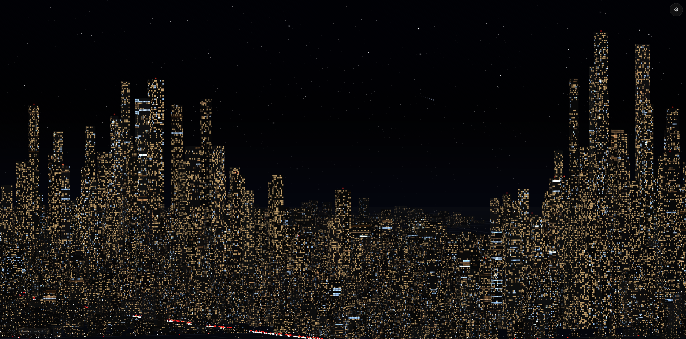

# Starry Night

<p align="center">
  
</p>

> Modernized homage to the Berkeley Systems After Dark "Starry Night" screensaver: a procedural night cityscape rendered in the browser with Three.js and React Three Fiber.

**Live demo:** https://redlamp.github.io/starry-night/

## Highlights

- **Seeded and deterministic.** Every city is a pure function of its seed. The same seed always produces the same city, down to each lit window; different seeds produce categorically different cities, not variations on a template.
- **Streets-first city grammar.** A tensor-field road network (highways, arterials, streets) is laid down first, districts are derived from the network's closure, and buildings fill the lots inside.
- **Density gradient.** A dense downtown core eases out through mid-rise belts, curvilinear suburban pods, exurban hamlets, and undeveloped fringe. The falloff is on absolute distance, so larger cities add outer rings rather than stretching the same gradient over more ground.
- **Socioeconomic lighting.** District character (downtown, subcentre, heritage, mixed-use, residential, industrial) drives building archetypes, window warmth, and streetlight colour temperature.
- **Layered night scene.** Stars with twinkle and the occasional shooting star, a moon, atmospheric haze and fog, streetlights, and ambient traffic head and tail lights.
- **Wake-up intro.** Windows and streetlights cascade on over a tunable sequence as the city loads.
- **Camera.** Orbit, free-fly, and top-down modes, a perspective/orthographic toggle, and aspect-aware framing for any window shape.
- **Tooling.** A searchable settings panel, a top-down city-planning overlay, a tensor-field visualizer, debug tints, and quality tiers from "Truck Stop" to "Metropolis".

## Tech stack

- Next.js 16 (App Router) and React 19, in TypeScript
- Three.js, React Three Fiber, drei
- Zustand for runtime state, seedrandom for deterministic RNG
- Tailwind CSS v4, shadcn/ui (on base-ui), lucide-react
- GSAP for camera and motion tweening
- Bun as runtime and package manager
- ESLint and Prettier; Playwright and tsx for capture and scripts
- Deployed to GitHub Pages from `main`

## Getting started

Requires [Bun](https://bun.sh) and a WebGL2-capable browser.

```bash
bun install
bun dev
```

The dev server runs on http://localhost:7827.

### Scripts

| Command | What it does |
| --- | --- |
| `bun dev` | Dev server (Turbopack, port 7827) |
| `bun run build` | Production build |
| `bun run start` | Serve the production build |
| `bun run lint` | ESLint |
| `bun run format` | Prettier write (`bun run format:check` to verify) |
| `bunx tsc --noEmit` | TypeScript check |
| `bun run capture` | Headless scene capture for stills |
| `bun run scripts/gate1.ts` | Generator verification suite |

## Routes

- `/` - the cityscape
- `/plan` - top-down city-planning overlay (roads, districts, density bands, population heat map)
- `/tensor` - the road-shaping tensor field
- `/palette` - colour and material reference

## Project layout

- `lib/seed/` - deterministic generation: topology, tensor-field streets, districts, density, population, and building fill
- `components/scene/` - the R3F scene: instanced city, roads, streetlights, traffic, moon, stars, atmosphere
- `components/ui/` - the settings panel and controls
- `lib/state/` - the Zustand runtime store
- `docs/PRD.md` - product spec, stack, and scope
- `wiki/` - decisions, design notes, and daily logs (an Obsidian vault)
- `scripts/` - capture and verification tooling

## Architecture notes

- **Determinism is the contract.** Scene state never derives from `Math.random()`, `Date.now()`, or `performance.now()`. Flicker and animation come from shader math over a per-element seed and a uniform clock. The `gate1` script asserts this and other invariants.
- **Two-tier state.** Anything derived from the seed is recomputed and never stored; only runtime settings (seed, mode, quality, paused) live in Zustand.
- **Instanced buildings, shader-painted windows.** Buildings are an `InstancedMesh` per archetype; windows are drawn by a fragment shader reading per-window state from a small data texture, so a face of many windows costs no extra draw calls.
- **HDR-feel colour.** sRGB output with ACES tone mapping; emissive values above 1.0 bloom naturally under ACES.

Contributor conventions live in `CLAUDE.md`; project decisions and history live in `wiki/`.
